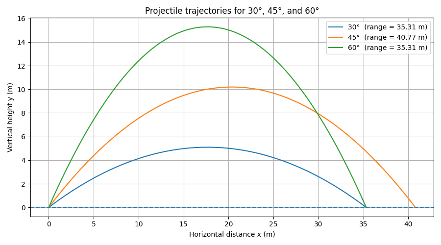

# Task 02 – Range Optimization

## Problem Statement

For projectile motion, the range is

$$
R(\theta) = \frac{v_0^2 \sin(2\theta)}{g}
$$

Show that the maximum range is achieved at launch angle

$$
\theta = 45^\circ
$$

## Theory

In this formula,

$$
\frac{v_0^2}{g}
$$

is constant, because the initial speed $v_0$ and gravity $g$ are fixed.

So the only part that changes with the angle is

$$
\sin(2\theta)
$$

The sine function reaches its maximum value when

$$
\sin x = 1
$$

which happens at

$$
x = 90^\circ
$$

## Step-by-Step Solution

We want the range

$$
R(\theta) = \frac{v_0^2 \sin(2\theta)}{g}
$$

to be as large as possible.

Since

$$
\frac{v_0^2}{g}
$$

is just a constant, this means we only need to maximize

$$
\sin(2\theta)
$$

The maximum value of sine is

$$
1
$$

So the maximum range occurs when

$$
\sin(2\theta) = 1
$$

This happens when

$$
2\theta = 90^\circ
$$

Therefore,

$$
\theta = 45^\circ
$$

## Final Result

The maximum range is achieved when

$$
\theta = 45^\circ
$$

## Interpretation

A small launch angle gives a large horizontal speed but short flight time.

A large launch angle gives a long flight time but small horizontal speed.

The angle

$$
45^\circ
$$

gives the best balance between these two effects, so the projectile travels the farthest.

# Task 02 – Range Optimization

## Problem Statement

For projectile motion, the range is

$$
R(\theta) = \frac{v_0^2 \sin(2\theta)}{g}
$$

Show analytically that for fixed initial speed $v_0$, the maximum range is achieved at launch angle

$$
\theta = 45^\circ
$$

## Theory

For fixed $v_0$ and $g$, the range depends only on the angle $\theta$. Therefore, maximizing $R(\theta)$ reduces to maximizing the trigonometric factor $\sin(2\theta)$.

A function reaches an extremum at points where its derivative vanishes or is undefined. The nature of the extremum is checked using the second derivative or by direct comparison.

## Step-by-Step Solution

The range is

$$
R(\theta) = \frac{v_0^2}{g} \sin(2\theta)
$$

Since $\frac{v_0^2}{g}$ is a constant, differentiate only the sine term:

$$
\frac{dR}{d\theta} = \frac{v_0^2}{g} \cdot 2 \cos(2\theta)
$$

Thus,

$$
\frac{dR}{d\theta} = \frac{2 v_0^2}{g} \cos(2\theta)
$$

Set the derivative equal to zero:

$$
\cos(2\theta) = 0
$$

This occurs when

$$
2\theta = 90^\circ + 180^\circ k
$$

For physically relevant launch angles

$$
0^\circ \leq \theta \leq 90^\circ
$$

the only admissible solution is

$$
2\theta = 90^\circ
$$

Hence,

$$
\theta = 45^\circ
$$

To verify that this is a maximum, compute the second derivative:

$$
\frac{d^2 R}{d\theta^2} = -\frac{4 v_0^2}{g} \sin(2\theta)
$$

At

$$
\theta = 45^\circ
$$

one has

$$
\sin(90^\circ) = 1
$$

so

$$
\frac{d^2 R}{d\theta^2} = -\frac{4 v_0^2}{g} < 0
$$

Therefore, the range is maximal at this angle.

## Final Result

The maximum range is achieved when

$$
\theta = 45^\circ
$$

## Interpretation

For fixed launch speed, the horizontal and vertical roles of the initial velocity are balanced most effectively at $45^\circ$. A smaller angle gives more horizontal speed but less flight time, while a larger angle gives more flight time but less horizontal speed. The optimal compromise occurs at $45^\circ$.