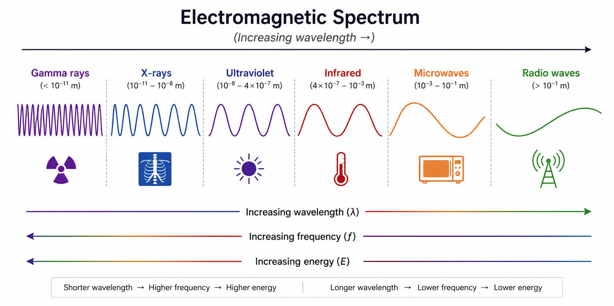

# Task 08 – Electromagnetic Spectrum Ordering

## Problem Statement

List the following types of electromagnetic radiation in order of increasing wavelength:

- Infrared
- Ultraviolet
- Microwaves
- X-rays
- Radio waves
- Gamma rays

## Theory

In the electromagnetic spectrum, shorter wavelength corresponds to higher frequency and higher photon energy.

## Step-by-Step Solution

From shortest wavelength to longest wavelength, the general order is:

$$
\text{Gamma rays} \rightarrow \text{X-rays} \rightarrow \text{Ultraviolet} \rightarrow \text{Visible} \rightarrow \text{Infrared} \rightarrow \text{Microwaves} \rightarrow \text{Radio waves}
$$

Since visible light is not included in the list, remove it and keep the remaining terms in order.

## Final Result

In order of increasing wavelength:

$$
\text{Gamma rays} \rightarrow \text{X-rays} \rightarrow \text{Ultraviolet} \rightarrow \text{Infrared} \rightarrow \text{Microwaves} \rightarrow \text{Radio waves}
$$

## Interpretation

Gamma rays and X-rays are the shortest-wavelength, highest-energy forms of radiation, while radio waves have the longest wavelengths and lowest frequencies.
